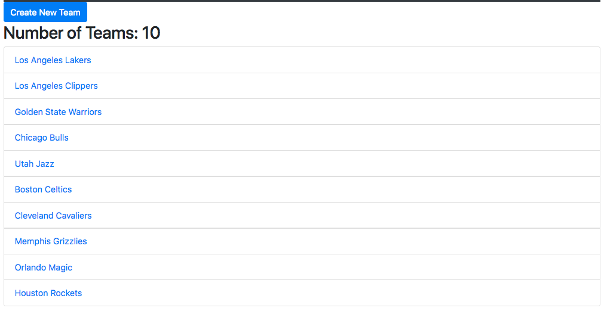

## Project #4

#    Laleh's Basketball Application 

  
  
 

   
            
           
         

  

    
 App logic:
---  
An app that provides users to sign up and get information about teams, team details and players.
Each user can add a new team to the list, can edit or delete a team. The user can also click on each team to see the logo, name and number of the players in each team. Clicking on players option in the navbar gives users the details of each player such as fullname, height and weight. Users can use the log in option if they are already a member.  
 
### Players 
 
   
### Teams 

 
### TeamDetail 
  
  

  
 
Wireframe Diagram:
---
               
 

ERD Diagram:  
---

  
  
Installation instructions:  
--- 
### Create
* Fork and clone the existing app in Github
* Add the .env file to the code

### serverside
* Open Mongod in terminal 
* Open nodemon in terminal   

### Client 
* Cd into client directory 
* Run npm install
* Add the packages that are needed npm install (name of the package) -- save
* Finally npm Start   

Online deployment (Heroku)

Tools:
---  
* HTML
* CSS/SCSS
* Javascript
* Chrome Developer Console
* Visual Studio
* MacDown  
* Trello Board
* Fluidui for Wireframe
* Gliffy for ERD
* Pitch deck

Packages:
---
* express
* dotenv
* bcrypt-nodejs
* morgan
* mongoose 
* axios
* jwt-decode
* body-parser
* milligram
* react
* react-dom
* react-router-dom
* reactstrap
* bootstrap

Resources:
---  
* [MDN Javascript Docs](https://developer.mozilla.org/en-US/docs/Web/JavaScript) 
* [Hack Design](https://hackdesign.org/lessons) 

Approach:
---
* Think about the functionality of the app  
* Start writing the steps need to be done in Trello Board
* Start with Wireframe of the app
* Start to create the models and connection between them
* ERD-Diagram
* Starting with code
* Complete the code
* Design the code
* Pitch deck
* Future steps that can be done in order to make the app more usable
* Readme

  

Future Enhancements:
---

  
1. Add more models to the app
3. Add more Components to the app such as coach and scores
1. Change the style of the app

Acknowledgements
---
#### Links 

* [Heroku]()  
* [Github](https://github.com/lalehnastar/basketball-app)  
* [Trello](https://trello.com/b/f4mXjfsf/project4-basketball-app)
* [Pitch deck](https://app.slidebean.com/editor/1PjFbP6ANN#outline2)